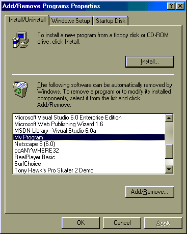

<div align="center">

## Add and Remove your program to the Add/Remove Programs and Run at Startup lists\!\! \(SMALL CLASS FILE\)


</div>

### Description

Allows you to easily add your program to the Add/Remove programs list, and also add your program to the Run registry key so it starts every time Windows starts!

I didn't see code that adds to the Add/Remove Programs bit here, so I made it myself! Though I find the basic registry routines here, I did Enum one of the arguments to make calling them faster!

Please Vote!
 
### More Info
 
ProgramName and EXE file Paths are needed to set the Uninstall File or File to run at startup

You need to have a

Dim VarAddRemove as New AddRemove

in the Declarations area, and a

Set VarAddRemove = New AddRemove

in the Form_Load event or Sub Main()

Returns Nothing.

Dangerous to mess with registry keys!


<span>             |<span>
---                |---
**Submitted On**   |
**By**             |[Rabid Nerd Productions](https://github.com/Planet-Source-Code/PSCIndex/blob/master/ByAuthor/rabid-nerd-productions.md)
**Level**          |Beginner
**User Rating**    |4.6 (92 globes from 20 users)
**Compatibility**  |VB 4\.0 \(32\-bit\), VB 5\.0, VB 6\.0
**Category**       |[Windows API Call/ Explanation](https://github.com/Planet-Source-Code/PSCIndex/blob/master/ByCategory/windows-api-call-explanation__1-39.md)
**World**          |[Visual Basic](https://github.com/Planet-Source-Code/PSCIndex/blob/master/ByWorld/visual-basic.md)
**Archive File**   |[](https://github.com/Planet-Source-Code/rabid-nerd-productions-add-and-remove-your-program-to-the-add-remove-programs-and-run-at-s__1-12990/archive/master.zip)

### API Declarations

```
Private Declare Function RegCloseKey Lib "advapi32.dll" (ByVal Hkey As Long) As Long
Private Declare Function RegCreateKey Lib "advapi32.dll" Alias "RegCreateKeyA" (ByVal Hkey As Long, ByVal lpSubKey As String, phkResult As Long) As Long
Private Declare Function RegDeleteKey Lib "advapi32.dll" Alias "RegDeleteKeyA" (ByVal Hkey As Long, ByVal lpSubKey As String) As Long
Private Declare Function RegDeleteValue Lib "advapi32.dll" Alias "RegDeleteValueA" (ByVal Hkey As Long, ByVal lpValueName As String) As Long
Private Declare Function RegOpenKey Lib "advapi32.dll" Alias "RegOpenKeyA" (ByVal Hkey As Long, ByVal lpSubKey As String, phkResult As Long) As Long
Private Declare Function RegQueryValueEx Lib "advapi32.dll" Alias "RegQueryValueExA" (ByVal Hkey As Long, ByVal lpValueName As String, ByVal lpReserved As Long, lpType As Long, lpData As Any, lpcbData As Long) As Long
Private Declare Function RegSetValueEx Lib "advapi32.dll" Alias "RegSetValueExA" (ByVal Hkey As Long, ByVal lpValueName As String, ByVal Reserved As Long, ByVal dwType As Long, lpData As Any, ByVal cbData As Long) As Long
Const ERROR_SUCCESS = 0&
Const REG_SZ = 1 ' Unicode nul terminated String
Const REG_DWORD = 4 ' 32-bit number
Public Enum HKeyTypes
HKEY_CLASSES_ROOT = &H80000000
HKEY_CURRENT_USER = &H80000001
HKEY_LOCAL_MACHINE = &H80000002
HKEY_USERS = &H80000003
HKEY_PERFORMANCE_DATA = &H80000004
End Enum
```


### Source Code

```

Public Sub AddToList(ProgramName As String, UninstallCommand As String)
'Add a program to the 'Add/Remove Programs' registry keys
Call SaveString(HKEY_LOCAL_MACHINE, "Software\Microsoft\Windows\CurrentVersion\Uninstall\" + ProgramName, "DisplayName", ProgramName)
Call SaveString(HKEY_LOCAL_MACHINE, "Software\Microsoft\Windows\CurrentVersion\Uninstall\" + ProgramName, "UninstallString", UninstallCommand)
End Sub
Public Sub RemoveFromList(ProgramName As String)
'Remove a program from the 'Add/Remove Programs' registry keys
Call DeleteKey(HKEY_LOCAL_MACHINE, "Software\Microsoft\Windows\CurrentVersion\Uninstall\" + ProgramName)
End Sub
Public Sub AddToRun(ProgramName As String, FileToRun As String)
'Add a program to the 'Run at Startup' registry keys
Call SaveString(HKEY_LOCAL_MACHINE, "Software\Microsoft\Windows\CurrentVersion\Run", ProgramName, FileToRun)
End Sub
Public Sub RemoveFromRun(ProgramName As String)
'Remove a program from the 'Run at Startup' registry keys
Call DeleteValue(HKEY_LOCAL_MACHINE, "Software\Microsoft\Windows\CurrentVersion\Run", ProgramName)
End Sub
Public Sub SaveKey(Hkey As HKeyTypes, strPath As String)
  Dim keyhand&
  r = RegCreateKey(Hkey, strPath, keyhand&)
  r = RegCloseKey(keyhand&)
End Sub
Public Function GetString(Hkey As HKeyTypes, strPath As String, strValue As String)
  'EXAMPLE:
  '
  'text1.text = getstring(HKEY_CURRENT_USER, "Software\VBW\Registry", "String")
  '
  Dim keyhand As Long
  Dim datatype As Long
  Dim lResult As Long
  Dim strBuf As String
  Dim lDataBufSize As Long
  Dim intZeroPos As Integer
  Dim lValueType As Long
  r = RegOpenKey(Hkey, strPath, keyhand)
  lResult = RegQueryValueEx(keyhand, strValue, 0&, lValueType, ByVal 0&, lDataBufSize)
  If lValueType = REG_SZ Then
    strBuf = String(lDataBufSize, " ")
    lResult = RegQueryValueEx(keyhand, strValue, 0&, 0&, ByVal strBuf, lDataBufSize)
    If lResult = ERROR_SUCCESS Then
      intZeroPos = InStr(strBuf, Chr$(0))
      If intZeroPos > 0 Then
        GetString = Left$(strBuf, intZeroPos - 1)
      Else
        GetString = strBuf
      End If
    End If
  End If
End Function
Public Sub SaveString(Hkey As HKeyTypes, strPath As String, strValue As String, strdata As String)
  'EXAMPLE:
  '
  'Call savestring(HKEY_CURRENT_USER, "Software\VBW\Registry", "String", text1.text)
  '
  Dim keyhand As Long
  Dim r As Long
  r = RegCreateKey(Hkey, strPath, keyhand)
  r = RegSetValueEx(keyhand, strValue, 0, REG_SZ, ByVal strdata, Len(strdata))
  r = RegCloseKey(keyhand)
End Sub
Public Function DeleteValue(ByVal Hkey As HKeyTypes, ByVal strPath As String, ByVal strValue As String)
  'EXAMPLE:
  '
  'Call DeleteValue(HKEY_CURRENT_USER, "Software\VBW\Registry", "Dword")
  '
  Dim keyhand As Long
  r = RegOpenKey(Hkey, strPath, keyhand)
  r = RegDeleteValue(keyhand, strValue)
  r = RegCloseKey(keyhand)
End Function
Public Function DeleteKey(ByVal Hkey As HKeyTypes, ByVal strPath As String)
  'EXAMPLE:
  '
  'Call DeleteKey(HKEY_CURRENT_USER, "Software\VBW\Registry")
  '
  Dim keyhand As Long
  r = RegDeleteKey(Hkey, strPath)
End Function
```

